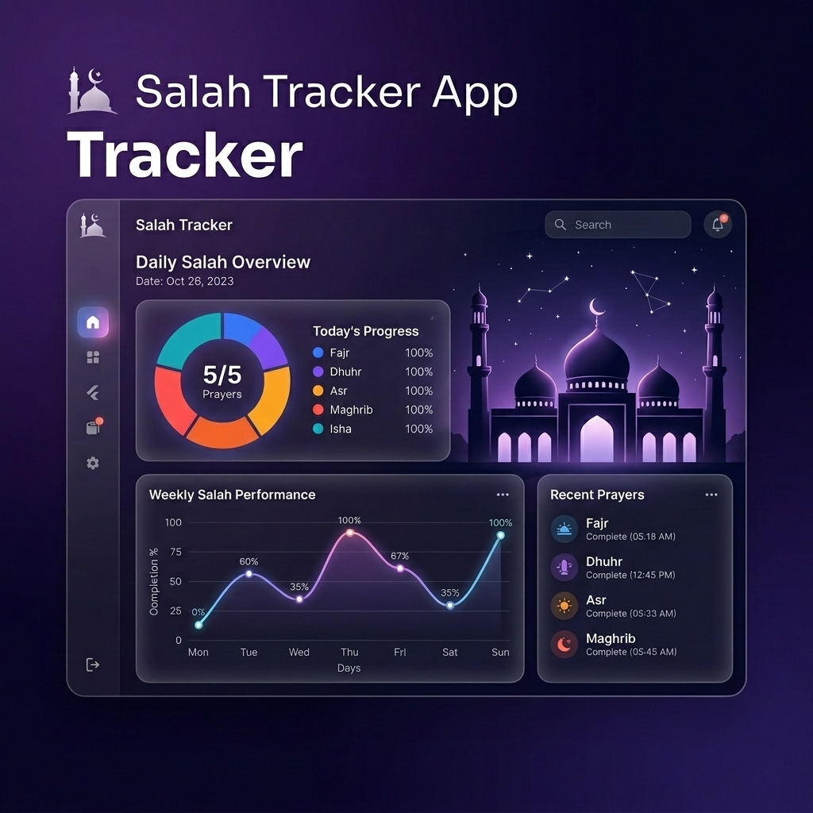

# 🕌 Salah Tracker App



<div align="center">
  <h3>🚀 DOWNLOAD NOW</h3>
  <a href='https://play.google.com/store/apps/details?id=com.sahed.salah_tracker'>
    
  </a>
</div>

<div align="center">

[](https://flutter.dev)
[](https://supabase.com)
[](https://riverpod.dev)

</div>

**Salah Tracker App** is a premium, **AD-FREE** spiritual companion designed to help you track your daily prayers and build a consistent habit through beautiful data visualizations and an elegant, modern interface.

---

## 🌟 Quick Overview

👉 **Track 5 daily prayers**  
👉 **Daily, weekly, monthly, and yearly statistics**  
👉 **100% Ad-free experience**  
👉 **English & Bengali language support**  
👉 **Premium Light & Dark modes**

---

## ✨ Why Salah Tracker App?

> [!IMPORTANT]
> **100% AD-FREE**: Your spiritual journey should be sacred. We guarantee zero interruptions—no pop-ups, no banners, and no video ads. Just you and your devotion.

### 💎 Premium Glassmorphism UI

Experience a stunningly designed interface with translucent "glass" effects, smooth blurs, and premium animations that make tracking your prayers a peaceful and high-end experience.

---

## 🚀 Key Features

### 🔹 Effortless Daily Logging

- **One-Tap Logging**: Record Fajr, Dhuhr, Asr, Maghrib, and Isha instantly.
- **Jummah Support**: Automatically transitions Dhuhr to Jummah on Fridays.
- **Detailed Status**: Classify prayers as **On Time**, **Qaza**, or **Missed**.
- **Historical Editing**: Navigate through time to update past logs with ease.

### 📊 Advanced Analytics & Insights

- **Dynamic Dashboard**: Real-time completion rates for Day, Week, and Month.
- **Weekly Trends**: Visualized progress with stacked bar charts.
- **Monthly Distribution**: Pie chart breakdown of your consistency.
- **Yearly Stats**: High-performance line graphs for long-term growth monitoring.

### 🔥 Motivation & Streaks

- **Prayer Streaks**: Stay motivated with a counter that tracks your consecutive days of perfect prayer logs.
- **Daily Reminders**: Automated nightly notifications to ensure you never miss a log.

### 🔄 Secure Cloud Sync

- **Google Sign-In**: Securely back up your data via Supabase.
- **Multi-Device**: Access your spiritual history across all your devices.
- **Privacy First**: Your data is encrypted and stored securely.

### 🎨 Personalization & Accessibility

- **Dual Themes**: Switch between a sleek **Dark Mode** and a crisp **Light Mode**.
- **Bilingual Support**: Fully localized in **English** and **Bengali (বাংলা)**.
- **Dynamic Styling**: Clean, modern Material 3 design throughout.

---

## 🛠️ Tech Stack

Built with modern technologies for peak performance and reliability:

- **Frontend**: Flutter (Material 3)
- **State Management**: Riverpod (with Code Generation)
- **Database**: SQLite (Local) + Supabase (Cloud Sync)
- **Charts**: `fl_chart`
- **Localization**: `easy_localization` (Supports English & Bangla)
- **Auth**: Google Sign-In & Supabase Auth

---

## 📥 Installation

1.  **Clone the repository:**
    ```bash
    git clone https://github.com/sahedalomsumit/salah-tracker.git
    ```
2.  **Install dependencies:**
    ```bash
    flutter pub get
    ```
3.  **Run Build Runner:**
    ```bash
    dart run build_runner build --delete-conflicting-outputs
    ```
4.  **Run the app:**
    ```bash
    flutter run
    ```

---

## 🤲 Support Our Mission

This app is a labor of love for the Ummah. If you find it helpful, please consider:

- Giving us a ⭐ on GitHub.
- Sharing it with your friends and family.
- Supporting development through **Sadaqah** (Stripe/bKash) via the in-app settings.

---

## 👤 Author

**Sahed Alom Sumit**

- Website: [sahedalomsumit.com](https://sahedalomsumit.com)
- LinkedIn: [@sahedalomsumit](https://linkedin.com/in/sahedalomsumit)
- GitHub: [@sahedalomsumit](https://github.com/sahedalomsumit)

---

_© 2026 Sahed Alom Sumit. Built with ❤️ by [Sahed](https://sahedalomsumit.com)._
